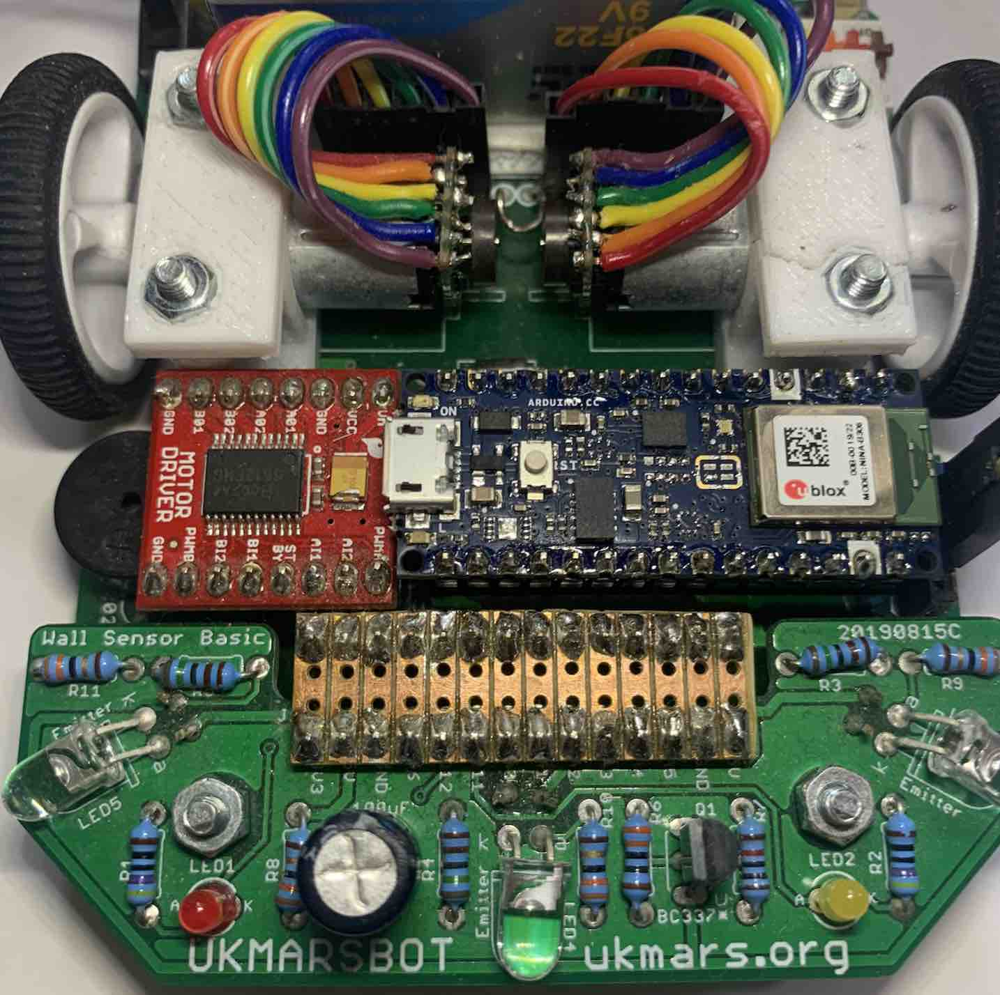
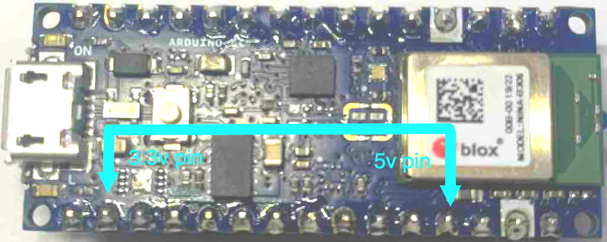
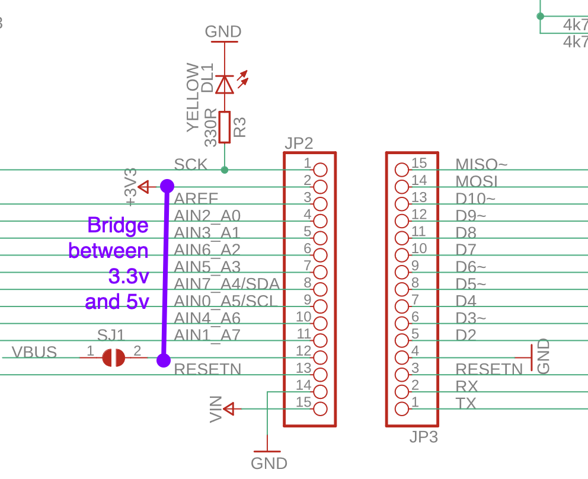
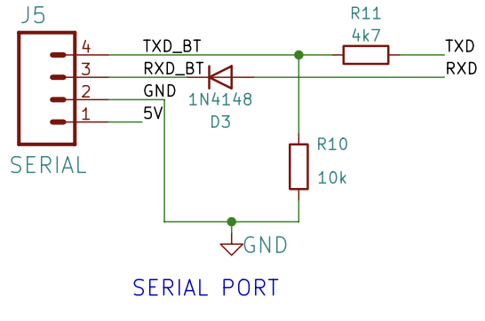

# Using the Arduino Nano 33 BLE with the UKMARSBot
Written up by Rob Probin, August 2023, based on discussion by Peter Harrison.

[Alternative Processors for UKMARSBOT](https://ukmars.org/2020/12/alternative-processors-for-ukmarsbot/)

[Video Describing Changes](https://youtu.be/_E6mRQq4exo?t=660)

## Introduction

The [Arduino Nano 33 BLE](https://docs.arduino.cc/hardware/nano-33-ble)
is a feature rich alternative to the Arduino Nano, with 
the much more powerful nRF52840 micocontroller 1 megabyte of Flash, 256KB of 
RAM, a 9-axis IMU (3D accelerator and gyroscope), and of course Bluetooth.

In terms of software environments, this can run:
 - in the Arduino environment (C/C++ with the Arduino library) on top of Arm® Mbed™ OS, 
 - in Micropython,
 - potentially in Forth via meCrisp and Zeptoforth - although official ports are 
   not avaialable yet. 

The IMU is connected via I2C, which *might* make it harder for the the IMU 
to be used for any real-time control - but not impossible. Of course, 
you can log the data and use it for analytics after runs - perhaps by plotting 
on a spreadsheet.

Without changes, the Arduino Nano 33 BLE does not supply 5v (there is a link you 
can short to connect the USB supply - but don't do this!). We will run the 
UKMARSbot logic exclusively at 3.3v because the I/O of the microcontroller is 
exclusively 3.3v. 

## Modification Steps

You can refer to the UKMARSBot schematics when reviewing these changes:

[UKMARSBot Hardware Repository](https://github.com/ukmars/ukmarsbot/tree/master/hardware)

### Step 1: Ensure 3.3v-compatible Exclusive-OR gate

You must replacing the original 74LS86 with an 74HC86 Exclusive-OR gate - so 
that the XOR gate runs at 3v logic.

If you already build the UKMARSbot with a 74HC86 then you are done!

If you haven't built it - you can use the 74HC86 at 5v and 3.3v - so you can 
use it with the original Arduino Nano if you choose not to use the Nano 33 BLE.

There are some pictures and description in this link:

[Description of 74HC86 change](http://zedcode.blogspot.com/2022/12/converting-ukmarsbot-to-raspberry-pi.html)

### Step 2: Reduce Battery Sense Voltage

You should change the battery measurement sense potential divider - so to avoid 
putting more than 3v on the I/O pin.

There are two alternatives to reduce the battery voltage sense output:

#### Battery Measurement Alternative 1:

Change the upper resistor of the potential divider (R7 - normally 10K) with a 22K.

There is some pictures in this link:

[Description of Battery Resistors](http://zedcode.blogspot.com/2022/12/converting-ukmarsbot-to-raspberry-pi.html)

#### Battery Measurement Alternative 2:

Peter suggesting soldering an additional resistor - see references below for 
technical details. However, the summary is to reduce the battery divider output 
by putting a 4k7 resistor in parallel with the existing resistor fitted as R8.

This gives a similar effect to Alternative 1, but might be easier if you have
already fitted the original resistors and don't want to remove R7 since
desoldering and removing resistors can be more tricky if you are not used to 
soldering practices.

### Step 3: Power the logic and sensors with 3.3v

Feed the 3.3v output from the Nano 33 BLE to the UKMARSbot 
logic / sensor power line - previously the 5v line. This means that 
(excluding the battery voltage) the rest of the board will run at 3.3v. This 
protects the microcontroller from having more than 3.3v on the GPIO.

To do this, you need to short the 3.3v and 5v nets together. 

There are two ways of doing this:

#### Method 1: Link on the Nano 33 BLE Connect

You can connect a link between on the Nano 33 BLE Connect.

This is from the 4th pin to the to the 3.3v pin (2nd pin from other direction)

#### Method 2: Short on the UKMARSBot PCB

An easy way to do this is on the end of the pin header of the sensor connector, 
as shown in this image:

Make sure you get the right end - otherwise you will end up shorting the 5v rail to ground!

### Step 4: Serial Port Connector Header Voltage

If you wish to connect a serial interface to the Serial Port header, then
we have might need to consider changes. You might use this with a USB to
serial converter or a HC05/HC06 Bluetooth module.

UKMARSbot v1.0 boards do not normally have circuitry. This will be a 3.3v I/O and 3v on 
the Power output; No changes necessary. Be careful not to connect the 5v/3v 
connector to any power source - although it can supply 3.3v to power something
else (being careful not to exceed the total 3.3v power from the Arduino Nano 
33 BLE).

UKMARSbot v1.1 and v1.3 boards have components to reduce the 5v logic to 3.3v. 

The serial connection *might* work even with the diode and resistors fitted. This
might be useful if you are swapping between 3v and 5v processor boards. 

If you want to make the change to 3v only, here you can:
  * Fit a wire instead of the D3 diode (or just short across the
    diode if you've already fitted D3).
  * Fit a wire instead of the R11 4k7 resistor (or just short across
    the resistor if you've already fitted R11.
  * Leave out the R10 10K resistor. (If you've already fitted it, then 
    either just leave it, remove via desoldering or just snip one of the 
    leads with side-cutters).

NOTE: The HC05/HC06 bluetooth modules they usually require 5v power but
have 3.3v logic - hence the extra components. They appear to work ok
at a 3.3v supply voltage and have need tested successfully by UKMARS 
members at 3 volts.

### Step 5: Plug in the Arduino Nano 33 BLE

Finally you can plug the Arduino Nano 33 BLE into the UKMARSBot 
socket where the Arduino Nano normally goes!

Make sure the device goes in the right way around!

### Stage 6 [OPTIONAL] - Sensor resistors

You might want to consider replacing the sensor board LED series drive 
resistors with lower value as they will be driven from 3.3v instead of 5v.

However for line following they will probably run OK with the lower 
voltage, and it might work as well for wall following. I suggest testing
before making any changes. It seems to work ok with default values.

The ADC input on the Arduino Nano 33 BLE board is higher resolution 
than on the original Arduino Nano so this helps to compensate.

Later when tuning your sensors - you might want consider lowering the 1K8 
(1800 ohm) load resistor (for the phototransistor) to reduce the sensitivity 
to incidental/ambient light. Some users have suggested 1200 ohms (1K2). It's worth noting
that there is no 'correct' answer for these values. It is only possible to 
specify values for a specific combination of emitter, detector and associated 
load resistors.

However, builders might like to start with a higher value, such as 1k8 and 
then test with reduced value by soldering on an extra parallel resistor if 
it is too high. This is easier then removing/replacing parts. For example, 
placing the following resistor value 'B' in parallel with 1800 Ohms, giving 
a new  'R' (combined resistance):

|   B   |   R  |
|-------|------|
| 22000 | 1664 |
| 15000 | 1607 |
| 12000 | 1565 |
| 10000 | 1525 |
| 6800  | 1423 |
| 5600  | 1362 |
| 4700  | 1302 |
| 3300  | 1165 |

You can find how to calculate the value of parallel resistors on the web by
searching. 

Generally builders should also be aware of the importance of shielding the 
detector adequately from ambient illuminations as well - both for IR and 
visible light systems. 

NOTE: Some builders also *increase* the phototransisor load resistor in 
order to increase ensure full scale on the ADC at high light level in order to 
gain extra resolution and sensitivity. Experiments are left to the robot builder.

## ADC Inputs

The standard Arduino Nano has 8 ADC (Analogue-to-digital) inputs. The Arduino 
Nano 33 BLE also has 8 channels. This table shows the arrangement. 

|Input| 1/2 Size Line Follower  | 3 Sensor Wall Follower | 4 Sensor Wall Follower | Notes     |
|-----|-------------------------|------------------------|------------------------|-----------|
|  A0 | Radius Mark Sensor      | Left Wall Sensor       | Wall Sensor            |           |
|  A1 | Line Left Side Sensor   | Front Wall Sensor      | Wall Sensor            |           |
|  A2 | Line Right Side Sensor  | Right Wall Sensor      | Wall Sensor            |           |
|  A3 | Start/Finish Mark Sensor| (not used)             | Wall Sensor            |           |
|  A4 | (not used)              | (not used)             | (not used)             |           |
|  A5 | (not used)              | (not used)             | (not used)             |           |
|  A6 | Function Sw. / Button   | Function / Button      | Function Sw. / Button  |           |
|  A7 | Battery Voltage sense   | Battery Voltage sense  | Battery Voltage sense  |           |

## Software Notes

The GPIO (general purpose input-output) pins are assigned to the same pins
when using the Arduino environment. 

In other environments you will need to look up the specific native 
Microcontroller pin and peripheral assignments.

## References

Peter Harrison discusion 3.3v running https://youtu.be/_E6mRQq4exo?t=1071

Raspberry Pico UKMARSbot https://ukmars.org/2021/02/a-raspberry-pi-pico-based-ukmarsbot/

Alternative Processors for UKMARSBOT https://ukmars.org/2020/12/alternative-processors-for-ukmarsbot/

For Micropython, David Hannaford is working on some code - but there is 
some simple non-robot example code here: 
https://github.com/robzed/UKMARSbot_RPi_Pico_Adapter

David Hannafords UKMARS page is here https://www.davidhannaford.com/ukmars/

