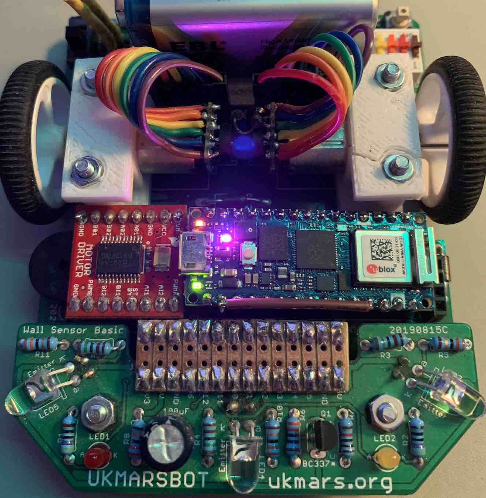
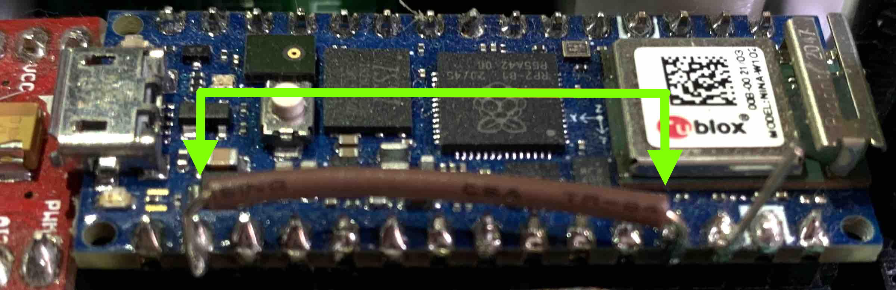
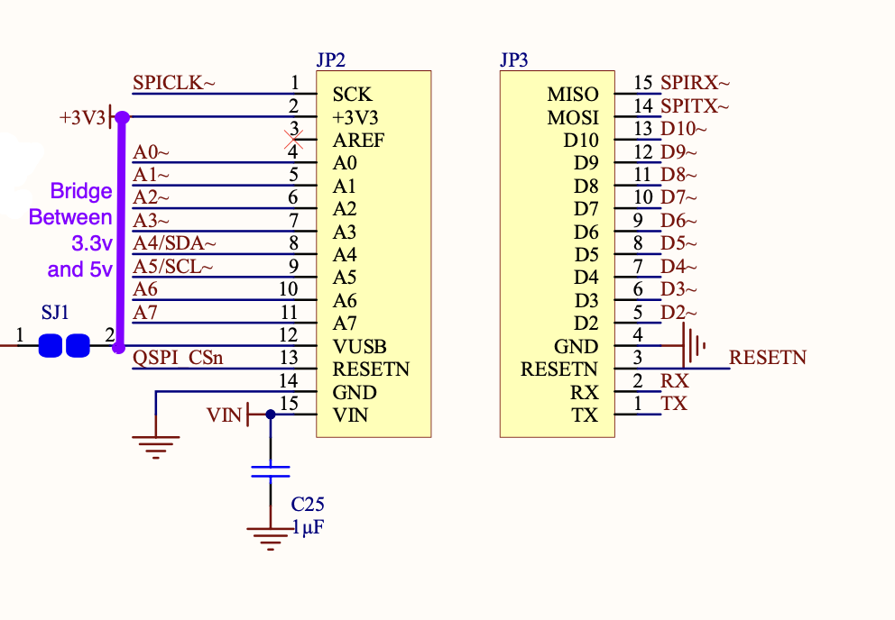
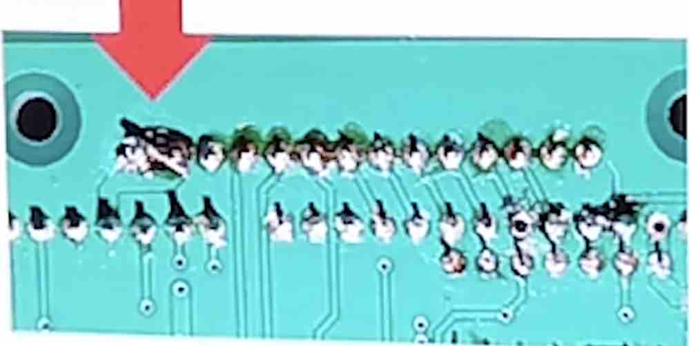
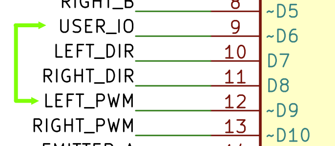

# Using the Arduino Nano RP2040 Connect with the UKMARSBot
Written up by Rob Probin, August 2023.

## Introduction

The [Arduino Nano RP2400 Connect](https://docs.arduino.cc/hardware/nano-rp2040-connect)
is a feature rich alternative to the Arduino Nano, with 
the much more powerful RP2040 microcontroller (the same micro used on the Raspberry Pi 
Pico), a Wi-Fi interface, 16 megabytes of Flash, a 6-axis IMU (3D accelerator and 
gyroscope), a temperature sensor and a microphone. It also has Bluetooth - although 
there are some limitations with this.

The IMU has a machine learning core, and Arduino have examples of using the RP2040
to run machine learning with TinyML, TensorFlow Lite or Edge Impulse.

In terms of software environments, this can run:
 - in the Arduino environment (C/C++ with the Arduino library), 
 - in standard C/C++ with the Pico SDK,
 - in Micropython,
 - in Forth, with Zeptoforth and meCrisp Forth.

Although this unit does have 8 ADC inputs, the upper four are connected 
to the U-blox® Nina W102 processor, which potentially slows access for these 
channels (to be confirmed).

The IMU is connected via I2C which *might* make it harder for the the IMU 
to be used for any real-time control. Of course, you can log the data and use it 
for analytics after runs - perhaps by plotting on a spreadsheet.

Without changes, the Arduino Nano RP2040 does not supply 5v (there is a link you 
can short to connect the USB supply - but don't do this!). We will run the 
UKMARSbot logic exclusively at 3.3v because the I/O of the RP2040 is exclusively 3.3v. 

## Modification Steps

You can refer to the UKMARSBot schematics when reviewing these changes:

[UKMARSBot Hardware Repository](https://github.com/ukmars/ukmarsbot/tree/master/hardware)

### Step 1: Ensure 3.3v-compatible Exclusive-OR gate

You must replacing the original 74LS86 with an 74HC86 Exclusive-OR gate - so 
that the XOR gate runs at 3v logic.

If you already build the UKMARSbot with a 74HC86 then you are done!

If you haven't built it - you can use the 74HC86 at 5v and 3.3v - so you can 
use it with the original Arduino Nano if you choose not to use the Nano RP2040 Connect.

There are some pictures and description in this link:

[Description of 74HC86 change](http://zedcode.blogspot.com/2022/12/converting-ukmarsbot-to-raspberry-pi.html)

### Step 2: Reduce Battery Sense Voltage

You should change the battery measurement sense potential divider - so to avoid 
putting more than 3v on the I/O pin.

There are two alternatives to reduce the battery voltage sense output:

#### Battery Measurement Alternative 1:

Change the upper resistor of the potential divider (R7 - normally 10K) with a 22K.

There is some pictures in this link:

[Description of Battery Resistors](http://zedcode.blogspot.com/2022/12/converting-ukmarsbot-to-raspberry-pi.html)

#### Battery Measurement Alternative 2:

Peter suggesting soldering an additional resistor - see references below for 
technical details. However, the summary is to reduce the battery divider output 
by putting a 4k7 resistor in parallel with the existing resistor fitted as R8.

This gives a similar effect to Alternative 1, but might be easier if you have
already fitted the original resistors and don't want to remove R7 since
desoldering and removing resistors can be more tricky if you are not used to 
soldering practices.

### Step 3: Power the logic and sensors with 3.3v

Feed the 3.3v output from the Nano RP2040 Connect to the UKMARSbot 
logic / sensor power line - previously the 5v line. This means that 
(excluding the battery voltage) the rest of the board will run at 3.3v. This 
protects the RP2040 from having more than 3.3v on the GPIO.

To do this, you need to short the 3.3v and 5v nets together. 

There are two ways of doing this:

#### Method 1: Link on the Nano RP2040 Connect

You can connect a link between on the Nano RP2040 Connect.

This is from the 4th pin to the to the 3.3v pin (2nd pin from other direction)

#### Method 2: Short on the UKMARSBot PCB

An easy way to do this is on the end of the pin header of the sensor connector, 
as shown in this image:

Make sure you get the right end - otherwise you will end up shorting the 5v rail to ground!

### Step 4: Serial Port Connector Header Voltage

If you wish to connect a serial interface to the Serial Port header, then
we have might need to consider changes. You might use this with a USB to
serial converter or a HC05/HC06 Bluetooth module.

UKMARSbot v1.0 boards do not normally have circuitry. This will be a 3.3v I/O and 3v on 
the Power output; No changes necessary. Be careful not to connect the 5v/3v 
connector to any power source - although it can supply 3.3v to power something
else (being careful not to exceed the total 3.3v power from the Arduino Nano 
RP2040 connect).

UKMARSbot v1.1 and v1.3 boards have components to reduce the 5v logic to 3.3v. 

The serial connection *might* work even with the diode and resistors fitted. This
might be useful if you are swapping between 3v and 5v processor boards. 

If you want to make the change to 3v only, here you can:
  * Fit a wire instead of the D3 diode (or just short across the
    diode if you've already fitted D3).
  * Fit a wire instead of the R11 4k7 resistor (or just short across
    the resistor if you've already fitted R11.
  * Leave out the R10 10K resistor. (If you've already fitted it, then 
    either just leave it, remove via desoldering or just snip one of the 
    leads with side-cutters).

NOTE: The HC05/HC06 bluetooth modules they usually require 5v power but
have 3.3v logic - hence the extra components. They appear to work ok
at a 3.3v supply voltage and have need tested successfully by UKMARS 
members at 3 volts.

### Step 5: Plug in the Arduino Nano RP2040 Connect

Finally you can plug the Arduino Nano RP2040 Connect into the UKMARSBot 
socket where the Arduino Nano normally goes!

Make sure the device goes in the right way around!

### Stage 6 [OPTIONAL] - Sensor resistors

You might want to consider replacing the sensor board LED series drive 
resistors with lower value as they will be driven from 3.3v instead of 5v.

However for line following they will probably run OK with the lower 
voltage, and it might work as well for wall following. I suggest testing
before making any changes. It seems to work ok with default values.

The ADC input on the Arduino Nano RP2040 Connect board is higher resolution 
than on the original Arduino Nano so this helps to compensate.

Later when tuning your sensors - you might want consider lowering the 1K8 
(1800 ohm) load resistor (for the phototransistor) to reduce the sensitivity 
to incidental/ambient light. Some users have suggested 1200 ohms (1K2). It's worth noting
that there is no 'correct' answer for these values. It is only possible to 
specify values for a specific combination of emitter, detector and associated 
load resistors.

However, builders might like to start with a higher value, such as 1k8 and 
then test with reduced value by soldering on an extra parallel resistor if 
it is too high. This is easier then removing/replacing parts. For example, 
placing the following resistor value 'B' in parallel with 1800 Ohms, giving 
a new  'R' (combined resistance):

|   B   |   R  |
|-------|------|
| 22000 | 1664 |
| 15000 | 1607 |
| 12000 | 1565 |
| 10000 | 1525 |
| 6800  | 1423 |
| 5600  | 1362 |
| 4700  | 1302 |
| 3300  | 1165 |

You can find how to calculate the value of parallel resistors on the web by
searching. 

Generally builders should also be aware of the importance of shielding the 
detector adequately from ambient illuminations as well - both for IR and 
visible light systems. 

NOTE: Some builders also *increase* the phototransisor load resistor in 
order to increase ensure full scale on the ADC at high light level in order to 
gain extra resolution and sensitivity. Experiments are left to the robot builder.

## ADC Inputs

The standard Arduino Nano has 8 ADC (Analogue-to-digital) inputs. The Arduino 
Nano RP2400 Connect has 4 ADC inputs connected to the RP2040, and 4 connected 
to the uBlox NINA. This table shows the arrangement. 

|Input| 1/2 Size Line Follower  | 3 Sensor Wall Follower | 4 Sensor Wall Follower |Nano RP2040 Connect      |
|-----|-------------------------|------------------------|------------------------|-------------------------|
|  A0 | Radius Mark Sensor      | Left Wall Sensor       | Wall Sensor            | RP2040                  |
|  A1 | Line Left Side Sensor   | Front Wall Sensor      | Wall Sensor            | RP2040                  |
|  A2 | Line Right Side Sensor  | Right Wall Sensor      | Wall Sensor            | RP2040                  |
|  A3 | Start/Finish Mark Sensor| (not used)             | Wall Sensor            | RP2040                  |
|  A4 | (not used)              | (not used)             | (not used)             | u-Blox NINA - Pull-ups! |
|  A5 | (not used)              | (not used)             | (not used)             | u-Blox NINA - Pull-ups! |
|  A6 | Function Sw. / Button   | Function / Button      | Function Sw. / Button  | u-Blox NINA             |
|  A7 | Battery Voltage sense   | Battery Voltage sense  | Battery Voltage sense  | u-Blox NINA             |

Note: A4 and A5 have 4k7 pull up resistors to allow them to be used with I2C devices - and these devices are the 
IMU and the authenicator secure element IC. So the ADC A4/A5 pin interacts with the I2C - see the following link:

https://support.arduino.cc/hc/en-us/articles/7454007471004-About-the-analog-pins-on-Nano-RP2040-Connect

Adrian E. reported that in Micropython that ADC doesn’t work on A6 or A7; hopefully this will get fixed soon. It seems fine in the Arduino environment. 

There is some example code for Micropython that talks to the NINA chip directly here:
    https://github.com/robzed/UKMARSbot_RPi_Pico_Adapter/blob/master/Arduino_Nano_RP2040_Connect/NINA.py

And the similar in Zeptoforth:
    https://github.com/robzed/ukmarsbot_forth/blob/master/for_rp2040/WiFiNINA_gpio.fth

### ADC maximum level

Also note that there was a bug fix to improve the full scale range on A4 to A7 in the Nina v1.5.0 firmware from 1.8v to 2.7v:

    https://forum.arduino.cc/t/analog-inputs-a4-a7-rp2040-connect/1019786
    https://github.com/arduino/nina-fw/blob/c84aa3406717af771653733fb9c3480bdf5e1a64/CHANGELOG#L4
    https://github.com/arduino/nina-fw/blob/master/CHANGELOG
    "* Fix ADC readings range (fuill scale range is now ~2.7V)"

If need to update the NINA firmware, these are the instructions:

   https://docs.arduino.cc/tutorials/nano-rp2040-connect/rp2040-upgrading-nina-firmware

If you have erased the Arduino base firmware (for example you've installed 
Micropython or Zeptoforth), you will need to reprogram it. You can drop
the blink example onto the board. Here are the instructions:

    https://docs.arduino.cc/tutorials/nano-rp2040-connect/rp2040-upgrading-nina-firmware#option-3-arduino-fw-uploader

### Function Sw. / Button Workarounds

You should be able to read these from the main task. I'm not sure whether 
reading from the interrupt routine will work - testing is required here. Since 
speed is not required for this input - it should be a problem reading a few
times (for debouncing the switch) from the main loop.

You probably want to take account of the voltage sense reading below. 

### Battery Voltage Sense Consideration

An important problem for the budding roboticist is the voltage sense ADC 
reading - since this allows you to compensate for variation in the battery 
voltage, and also signal when the battery is too low to continue. 

Since this uses the U-blox Nina to read the voltage, we need to take 
account of the delay talking to the Nina. 

If anyone has any concrete data about the latencies introduced and their 
effects (if any), or any other comments, let me know.

Here are some ideas:

   - Read the voltage from the main loop / main task and accept the slight latency between
     the PWM voltage adjustment and the battery voltage measurement.

   - If you are using a multi-threaded tasker (e.g. Arduino with mbed OS or Zeptoforth),
     use a high-priority task to frequently read the battery voltage at a regular interval
     (say every 2 milliseconds, and store it in a variable as normal for the rest 
     of the software to use). You might need to take care of conflicts between other uses
     uBlox NINA ADC - or just defer all other uses to this task to take care of. 

   - Test whether reading from the interrupt works, and doesn't introduce excessive 
     time delays in the interrupt processing, and doesn't break other uses of the uBlox
     NINA. (Most complex method to debug!)

   - Forgo voltage compensation, and make sure you always use fresh 
     batteries - course this is problematic since you will like get different 
     results during testing - but this is the easiest option. 

   - For battery-too-low only sensing you could add a comparator to 
     compare the voltage against a known low voltage to stop the mouse and feed 
     that into another GPIO pin.

   - If you are using a 3 input wall sensor, cross couple the battery sense
     to the unused A3 input (make sure you set the A7 pin to input if you 
     do not disconnect it).

   - If you are using the 1/2 size line follower board, forgo the radius mark sensor
     and use that input for the battery voltage sensor. You'd need to find the
     turn radii in software and keep some sort of map in order to do a faster run
     by memory. You'll probably need encoder odometry to make this work.

   - Fitting a seperate ADC chip. This seems excessive - but it's still a 
     possibility.

## Notes on Motor PWM outputs

The Raspberry Pi RP2040 has 8 PWM slices, with two channels each. 

The motor left and right PWM outputs are as follows:
 - GPIO21 is LEFT PWM (Arduino ‘D9’) - PWM slice 2B
 - GPIO5 is RIGHT PWM (Arduino ‘D10’) - PWM slice 2B

Both of these are on PWM slice 2B. This is bad because they can't be set independantly. 

There are at least three options which will be covered in sub-sections below.

 1. Swap or cross-couple an I/O line
 2. Use the PIO unit to generate the necessary PWM signal
 3. Use the second core to generate a PWM wave in software

### Option 1: Swap an I/O line

You will need to use another output and cross-couple it to that output. 

Two options are: 
 - GPIO18 (Arduino ‘D6’) - user IO on sensor board - used for one LED only on the five standard sensor boards. This is on PWM slice 1A.
 - GPIO6 (Arduino ‘D13’) - used for the on-board LED on Nano RP2040 connect and the mainboard LED (v1.0, v1.1 boards - no LED on v1.3) This on PWM slice 3A. Sometimes this is LED will pulse when the board is in "bootloader mode", and is often used for debugging.

Because Arduino 'D13' is often used for debugging or bootloader functions and 
always has at least on on-board LED, my belief is that the other option - 
GPIO13 (Arduino 'D6') - is the better choice.

The 'D6' / GPIO13 pin is closest to the LEFT PWM pin ('D9' / GPIO21) - there 
are two pins between these two.

We will therefore connect a link between these two pins. This can be done on 
the Arduino Nano RP2040 Connect itself, or on the motherboard. If you are 
using the motherboard for other boards (for example the original Arduino Nano, 
Arduino 33 BLE or the Cytron Maker Nano RP2040), then doing 
it on the module is a better option. Otherwise it doesn't matter.

The previous GPIO21 can be left as input only, and ignored. Theoretically you 
could disconnect it from the main board and use it for other purposes. 

### Option 2: Use the PIO unit

The Raspberry Pi has a very flexible PIO unit. This can make lots of 
output waveforms. Using it to generate a PWM is beyond the scope of this 
document however.

This has the advantage of leaving GPIO18 (Arduino 'D6') as spare for other
purposes. If you use this GPIO18/'D6' on a custom sensor board, for example,
then you'd want to avoid reassigning it - and this method would be the
best option - asuming you aren't using all the PIO units for other purposes.

### Option 3: Use the second core to generate a PWM waveform

Theoretically you could also use the second core to generate a PWM waveform 
in software - again this won't be covered here.

## Reflashing the Program

This board does not have a BOOTSEL button - just a reset button. To reprogram 
via a UF2 file drag-and-drop over USB as a mass-storage flash drive (like a 
normal Rapsberry Pi Pico) it's necessary to short two pins (labelled GND and 
REC on the underside - the second and third pins) and press the reset button.

Picture and Instructions can be found here:

[Reprogramming the Board](https://docs.arduino.cc/tutorials/nano-rp2040-connect/rp2040-01-technical-reference#board-not-detected)

## Bluetooth

This board can support Bluetooth Low Energy (aka BLE or Bluetooth LE). 

When you enable this you lose ability to communicate with the RGB LED.

This link contains the following warning: "While using the Bluetooth® Low 
Energy mode on the NINA module, the RGB cannot be used by default. While 
the module is in Bluetooth® Low Energy mode, SPI is deactivated, which 
is used to control the RGBs."

https://docs.arduino.cc/tutorials/nano-rp2040-connect/rp2040-01-technical-reference#rgb

It not clear whether the analogue inputs A4 to A7 are effected, although there 
is no warning here, so perhaps not: 

https://docs.arduino.cc/tutorials/nano-rp2040-connect/rp2040-01-technical-reference#analog-pins

The IMU gyroscope and accelerometer should be ok, because these are also 
connected to the RP2040 via I2C. 

Bluetooth Classic (e.g. serial port profile) is theoretically possible with
the underlying ESP32 in the U-blox Nina - but this isn't documented by 
Arduino as far as I can see. (Unlike the Pico W part, which Raspberry Pi 
added in.)

For more on BLE under the Arduino environment see these links:

 - https://docs.arduino.cc/tutorials/nano-rp2040-connect/rp2040-ble-device-to-device
 - https://www.arduino.cc/reference/en/libraries/arduinoble

## Software Notes

The GPIO (general purpose input-output) pins are assigned to the same pins
when using the Arduino environment. 

In other environments you will need to look up the specific native RP2040 
pin and peripheral assignments.

## References

Peter Harrison discusion 3.3v running https://youtu.be/_E6mRQq4exo?t=1071

Raspberry Pico UKMARSbot https://ukmars.org/2021/02/a-raspberry-pi-pico-based-ukmarsbot/

Alternative Processors for UKMARSBOT https://ukmars.org/2020/12/alternative-processors-for-ukmarsbot/

Some Zeptoforth reference code for the Maker Nano RP2040 is located here: 
https://github.com/robzed/Maker_Nano_RP2040_Forth_Demo
This is not Robot code!

For Micropython, David Hannaford is working on some code - but there is 
some simple non-robot example code here: 
https://github.com/robzed/UKMARSbot_RPi_Pico_Adapter

David Hannafords UKMARS page is here https://www.davidhannaford.com/ukmars/

