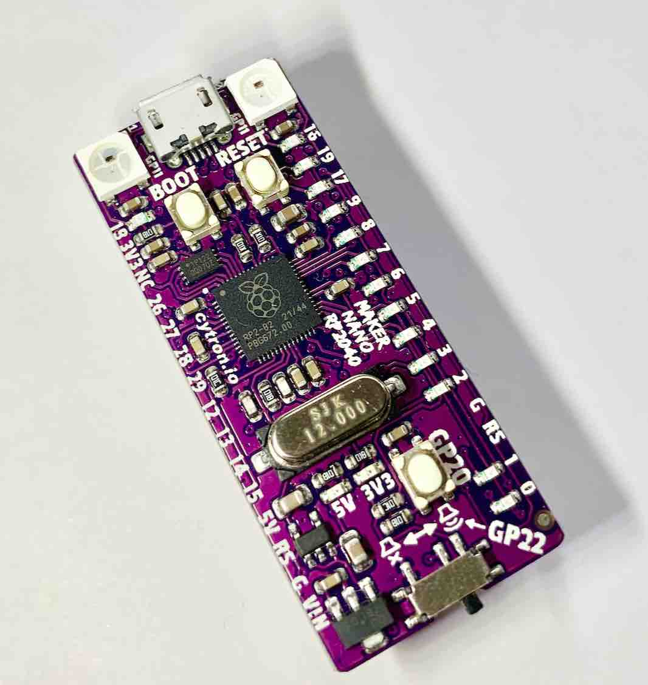
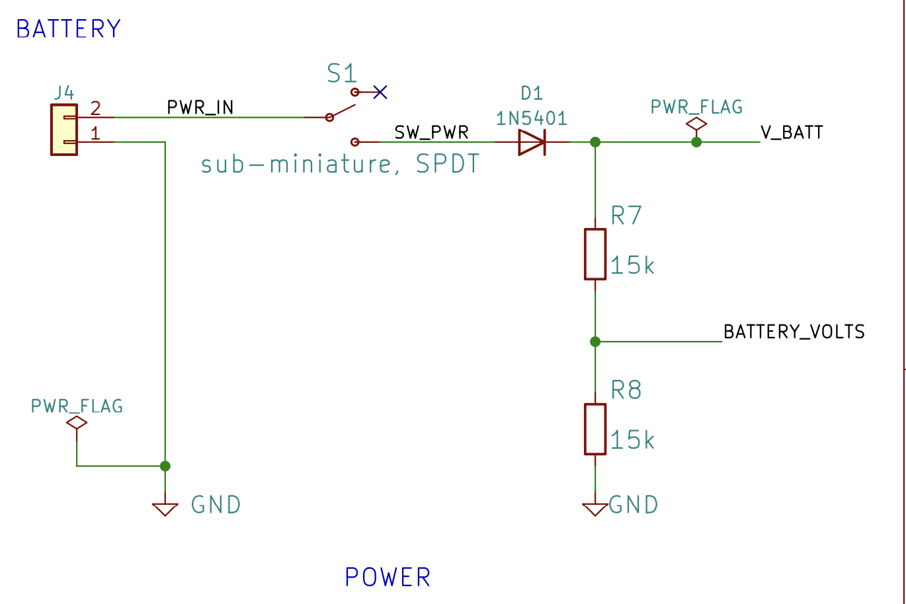
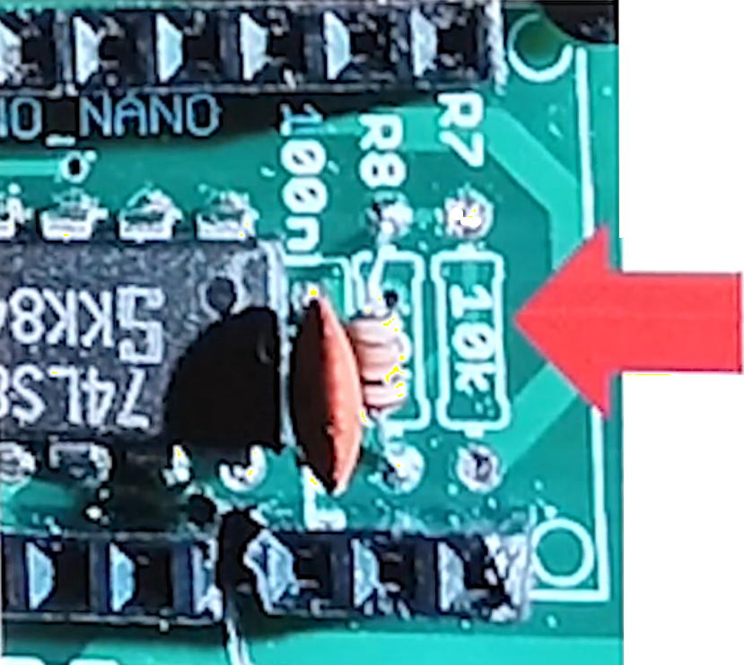
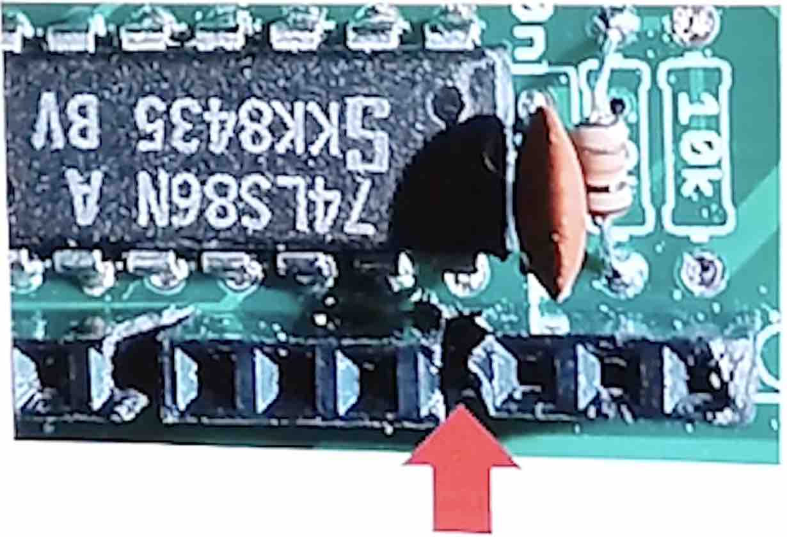
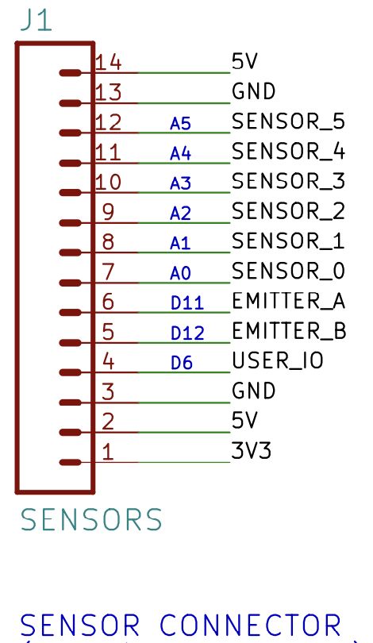
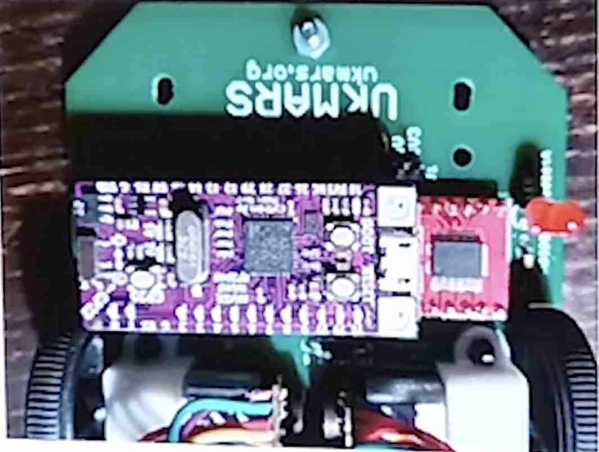

# Using the Cytron Maker Nano RP2040 with the UKMARSBot
Written up by Rob Probin, August 2023, based on original notes by David Hannaford.

## Introduction

The Cytron Maker Nano RP2040 is a cheap alternative to the Arduino Nano, with 
the much more powerful RP2040 microcontroller - the same micro used on the 
Raspberry Pi Pico. It has on on-board Piezo buffer, 2MB of flash, two RGB LEDs,
and a user button. It also has LEDs on quite a few of the GPIO (inputs and
output pins) which can aid in debugging.

This can run:
 - in the Arduino environment, 
 - in standard C/C++ with the Pico SDK,
 - in Micropython,
 - in CircuitPython,
 - in Forth, with Zeptoforth and meCrisp Forth.

However this unit only has 4 ADC inputs, which is a limitation, since the UKMARSBot
as designed uses more than this - details below.

Although the Maker Nano RP2040 supplies 5v, we will run the UKMARSbot logic 
exclusively at 3v because the I/O of the RP2040 is exclusively 3.3v. So we 
take care to disconnect the 5v power before use so that the RP2040 is not 
damaged.

## Modification Steps

### Step 1: Ensure 3.3v-compatible Exclusive-OR gate

You must replacing the original 74LS86 with an 74HC86 Exclusive-OR gate - so 
that the XOR gate runs at 3v logic.

If you already built the UKMARSbot with a 74HC86 then proceed to step 2.

If you haven't built it - you can use the 74HC86 at 5v and 3.3v - so you can 
use it with the original Arduino Nano if you choose not to use the Nano 33 BLE.

There are some pictures and description in this link:

[Description of 74HC86 change](http://zedcode.blogspot.com/2022/12/converting-ukmarsbot-to-raspberry-pi.html)

### Step 2: Reduce Battery Sense Voltage

You should change the battery measurement sense potential divider - so to avoid 
putting more than 3v on the I/O pin.

There are two alternatives to reduce the battery voltage sense output:

#### Battery Measurement Alternative 1:

Here you remove or leave out the R7 10Kohm resistor. 

This will stop the battery voltage/2 being fed to GP15 which could be above the 3.3v input pin voltage.

This is the easiest option for the Maker Nano RP2040. Removal of the R7 
resistor is simpler that the other alternatives and also means that you can 
potentially use the input for a different digital input if you want. 

You can determine how you wish to deal with this missing input below 
in the ADC section. (But remember _if_ you feed the voltage into another 
analogue input, then you will need to alter the battery sense potential 
divider as described in alternative 2 or alternative 3.

#### Battery Measurement Alternative 2:

This option doesn't fix the missing analog input See below for some ideas.

Change the upper resistor of the potential divider (R7 - normally 10K) with a 22K.

There is some pictures in this link:

[Description of Battery Resistors](http://zedcode.blogspot.com/2022/12/converting-ukmarsbot-to-raspberry-pi.html)

#### Battery Measurement Alternative 3:

This option doesn't fix the missing analog input See below for some ideas.

Peter suggesting soldering an additional resistor - see references below for 
technical details. However, the summary is to reduce the battery divider output 
by putting a 4k7 resistor in parallel with the existing resistor fitted as R8.

This gives a similar effect to Alternative 2, but might be easier if you have
already fitted the original resistors and don't want to remove R7 since
desoldering and removing resistors can be more tricky if you are not used to 
soldering practices.

### Step 3: Remove 5v Power

The 5v pin is fed into the UKMARSBot from the Arduino Nano fourth pin. You have two options here.

  1. Remove the pin from the Maker Nano RP2040 module itself.

  2. Remove the that specific pin socket from the UKMARSBot. 

(I've detailed removing the regulator from the Maker Nano RP2040, since 
there isn't a schematic supplied by Cytron so we can't be sure of the change).

Whatever you do it is *critical* that 5v is not fed into the underlying 
circuitry - since we will short the UKMARSBot PCB 5v pin to 3v in order to 
power the robot logic from 3v!!

If you are building the UKMARSBot from scratch, then the easiest method is to 
put an 11 pin socket and 3 pin socket instead of the normal 15 pin socket with
a gap between them, 

If you have already made the UKMARSBot then you can carefully snip that socket 
pin out with some side cutters.

### Step 4: Power the logic and sensors with 3.3v

To feed the 3.3v output from the Maker Nano RP2040 to the UKMARSbot power 
line - previously the 5v line. This means that, excluding the battery voltage, 
the rest of the board will run at 3.3v. This protects the RP2040 from having
more than 3.3v on the GPIO.

To do this, you need to short the 3.3v and 5v nets together. An easy way to 
do this is on the end of the pin header of the sensor connector, as shown 
in this image:

Make sure you get the right end - otherwise you will end up shorting the 5v rail to ground!

### Step 5: Serial Port Connector Header Voltage

If you wish to connect a serial interface to the Serial Port header, then
we have might need to consider changes. You might use this with a USB to
serial converter or a HC05/HC06 Bluetooth module.

UKMARSbot v1.0 boards do not normally have circuitry. This will be a 3.3v I/O and 3v on 
the Power output; No changes necessary. Be careful not to connect the 5v/3v 
connector to any power source - although it can supply 3.3v to power something
else (being careful not to exceed the total 3.3v power from the Maker Nano 
RP2040).

UKMARSbot v1.1 and v1.3 boards have components to reduce the 5v logic to 3.3v. 

The serial connection *might* work even with the diode and resistors fitted. This
might be useful if you are swapping between 3v and 5v processor boards. 

If you want to make the change to 3v only, here you can:
  * Fit a wire instead of the D3 diode (or just short across the
    diode if you've already fitted D3).
  * Fit a wire instead of the R11 4k7 resistor (or just short across
    the resistor if you've already fitted R11.
  * Leave out the R10 10K resistor. (If you've already fitted it, then 
    either just leave it, remove via desoldering or just snip one of the 
    leads with side-cutters).

NOTE: The HC05/HC06 bluetooth modules they usually require 5v power but
have 3.3v logic - hence the extra components. They appear to work ok
at a 3.3v supply voltage and have need tested successfully by UKMARS 
members at 3 volts.

### Step 6: Plug in the Arduino Nano RP2040

Finally you can plug the Cytron Maker Nano RP2040 into the UKMARSBot 
socket where the Arduino Nano normally goes!

Make sure the device goes the right way around!

### Stage 6 [OPTIONAL] - Sensor resistors

You might want to consider replacing the sensor board LED series drive 
resistors with lower value as they will be driven from 3.3v instead of 5v.

However for line following they will probably run OK with the lower 
voltage, and it might work as well for wall following. I suggest testing
before making any changes. It seems to work ok with default values.

The ADC input on the Cytron board is higher resolution than on
the original Arduino Nano so this helps to compensate.

Later when tuning your sensors - you might want consider lowering the 1K8 
(1800 ohm) load resistor (for the phototransistor) to reduce the sensitivity 
to incidental/ambient light. Some users have suggested 1200 ohms (1K2). It's worth noting
that there is no 'correct' answer for these values. It is only possible to 
specify values for a specific combination of emitter, detector and associated 
load resistors.

However, builders might like to start with a higher value, such as 1k8 and 
then test with reduced value by soldering on an extra parallel resistor if 
it is too high. This is easier then removing/replacing parts. For example, 
placing the following resistor value 'B' in parallel with 1800 Ohms, giving 
a new  'R' (combined resistance):

|   B   |   R  |
|-------|------|
| 22000 | 1664 |
| 15000 | 1607 |
| 12000 | 1565 |
| 10000 | 1525 |
| 6800  | 1423 |
| 5600  | 1362 |
| 4700  | 1302 |
| 3300  | 1165 |

You can find how to calculate the value of parallel resistors on the web by
searching. 

Generally builders should also be aware of the importance of shielding the 
detector adequately from ambient illuminations as well - both for IR and 
visible light systems. 

NOTE: Some builders also *increase* the phototransisor load resistor in 
order to increase ensure full scale on the ADC at high light level in order to 
gain extra resolution and sensitivity. Experiments are left to the robot builder.

## ADC Inputs

The standard Arduino Nano has 8 ADC (Analogue-to-digital) inputs.
The Maker Nano RP2040 only has 4 ADC inputs connected to the same place as A0 to A3 on the Nano. The equivalent ports to A4 to A7 go into digital-only inputs.

|Input| 1/2 Size Line Follower  | 3 Sensor Wall Follower | 4 Sensor Wall Follower |Maker Nano RP2040|
|-----|-------------------------|------------------------|------------------------|-----------------|
|  A0 | Radius Mark Sensor      | Left Wall Sensor       | Wall Sensor            |Analog & Digital |
|  A1 | Line Left Side Sensor   | Front Wall Sensor      | Wall Sensor            |Analog & Digital |
|  A2 | Line Right Side Sensor  | Right Wall Sensor      | Wall Sensor            |Analog & Digital |
|  A3 | Start/Finish Mark Sensor| (not used)             | Wall Sensor            |Analog & Digital |
|  A4 | (not used)              | (not used)             | (not used)             |Digital only     |
|  A5 | (not used)              | (not used)             | (not used)             |Digital only     |
|  A6 | Function Sw. / Button   | Function / Button      | Function Sw. / Button  |Digital only     |
|  A7 | Battery Voltage sense   | Battery Voltage sense  | Battery Voltage sense  |Digital only     |

### Function Sw. / Button Workarounds

It's not documented here, but you can probably modify the circuit to just have the 
button trigger the digital input connected to A6, and ignore (or remove) the function 
DIP switch. Specific circuit modifications welcome - email me, and I will update this
instruction page.

### Battery Voltage Sense Work Arounds

The more serious problem for the budding roboticist is the voltage sense - since 
this allows you to compensate for variation in the battery voltage, and also signal 
when the battery is too low to continue. 

Here are some ideas:
   - Fitting a seperate ADC chip (potentially using A4 and A5 to read this).

   - Forgo voltage compensation, and make sure you always use fresh 
     batteries - course this is problematic since you will like get different 
     results during testing - but this is the easiest option. 

   - For battery-too-low only sensing you could add a comparator to 
     compare the voltage against a known low voltage to stop the mouse and feed 
     that into A7.

   - If you are using a 3 input wall sensor, cross couple the battery sense
     to the unused A3 input (make sure you set the A7 pin to input if you 
     do not disconnect it).

   - If you are using the 1/2 size line follower board, forgo the radius mark sensor
     and use that input for the battery voltage sensor. You'd need to find the
     turn radii in software and keep some sort of map in order to do a faster run
     by memory. You'll probably need encoder odometry to make this work.

## Software Notes

The GPIO (general purpose input-output) pins are assigned differently. You 
will need to remap any inputs and outputs, or specialise peripherals in 
software in order for the software to work.

## References

These are based on the notes by David Hannaford, watch the start of the video here:
 - https://www.youtube.com/watch?v=oCECuOwtVjM

Peter Harrison discusion 3.3v running https://youtu.be/_E6mRQq4exo?t=1071

Raspberry Pico UKMARSbot https://ukmars.org/2021/02/a-raspberry-pi-pico-based-ukmarsbot/

Alternative Processors for UKMARSBOT https://ukmars.org/2020/12/alternative-processors-for-ukmarsbot/

Some Zeptoforth reference code for the Maker Nano RP2040 is located here: 
https://github.com/robzed/Maker_Nano_RP2040_Forth_Demo
This is not Robot code!

For Micropython, David Hannaford is working on some code - but there is 
some simple non-robot example code here: 
https://github.com/robzed/UKMARSbot_RPi_Pico_Adapter

David Hannafords UKMARS page is here https://www.davidhannaford.com/ukmars/

